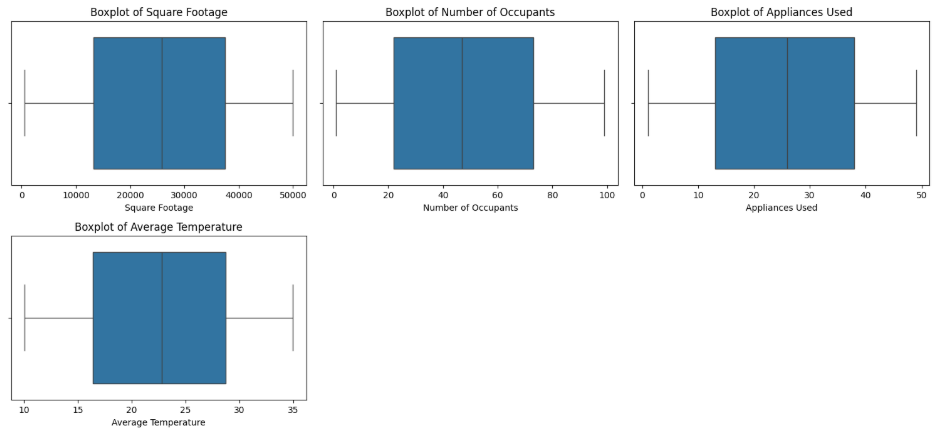
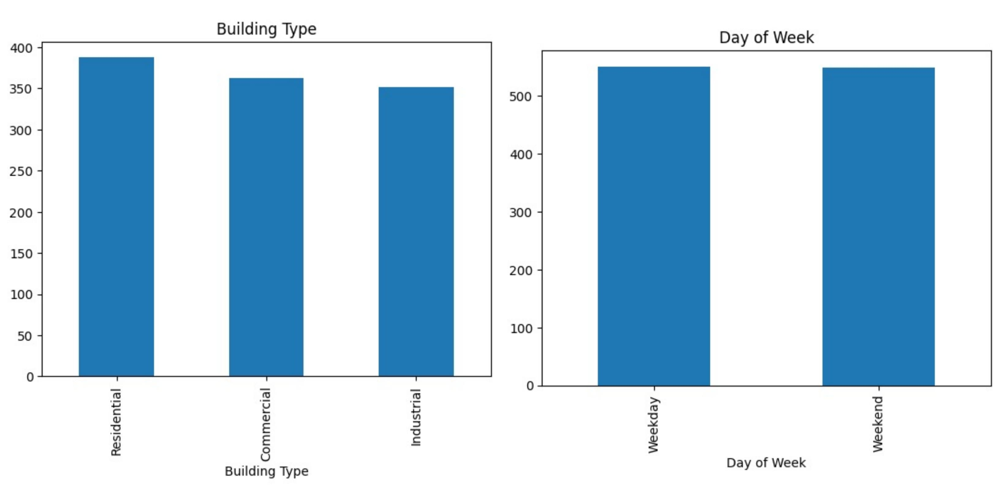
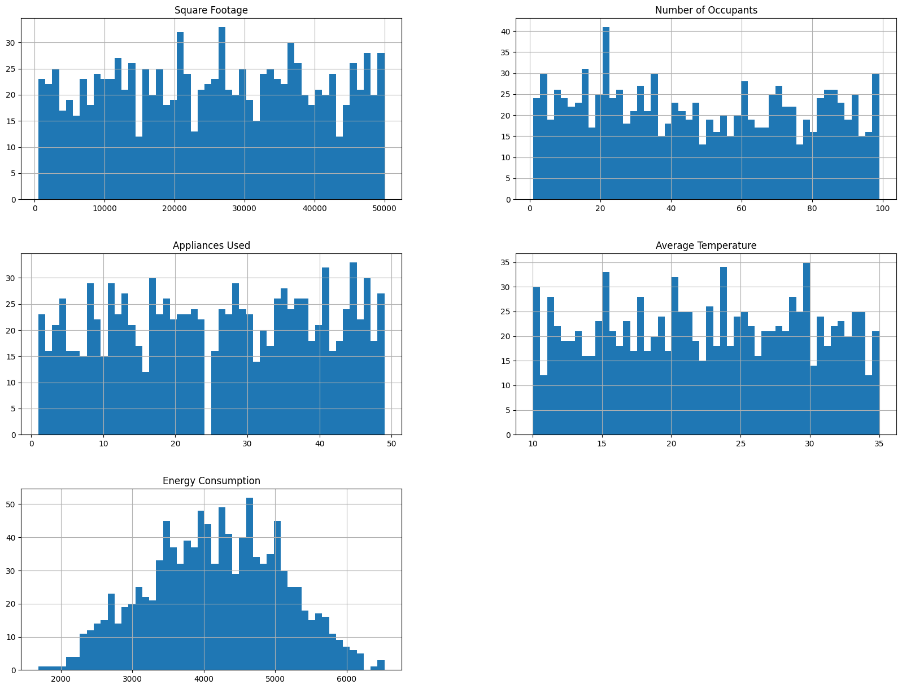
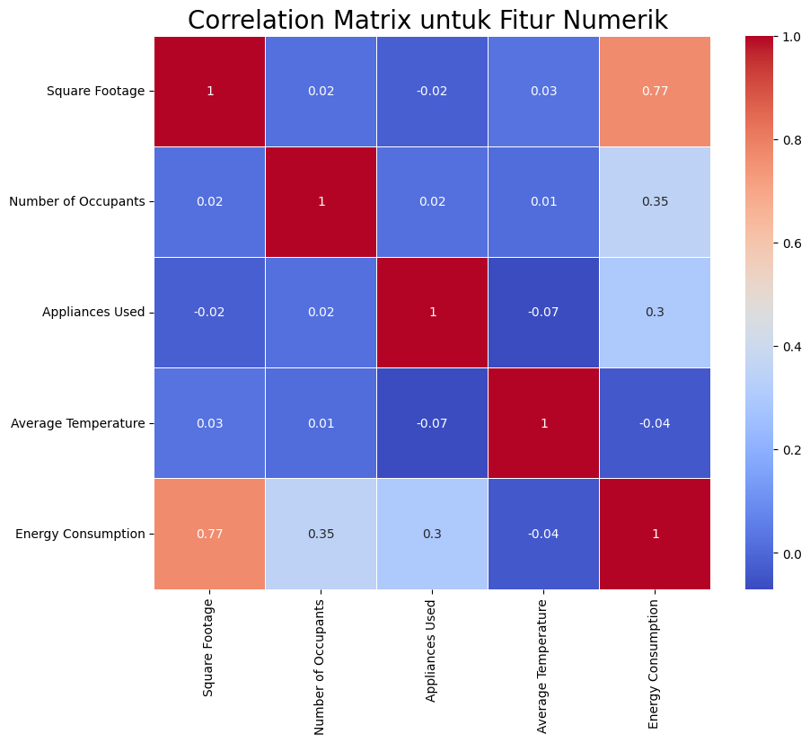

# Laporan Proyek Machine Learning - Abdul Rozak Ainurrofiq

## Domain Proyek

Konsumsi energi merupakan salah satu aspek penting dalam pengelolaan sumber daya pada bangunan modern, baik itu perkantoran, perumahan, maupun fasilitas industri. Seiring meningkatnya kebutuhan energi dan isu keberlanjutan, pengelolaan konsumsi energi secara efisien menjadi semakin krusial. Banyak faktor yang memengaruhi tingkat konsumsi energi suatu bangunan, seperti ukuran bangunan, jumlah penghuni, peralatan yang digunakan, jenis bangunan, serta kondisi lingkungan seperti suhu rata-rata dan hari dalam seminggu.

Dengan kemajuan teknologi dan ketersediaan data yang semakin melimpah, pendekatan berbasis machine learning menjadi solusi yang menjanjikan untuk memprediksi konsumsi energi secara lebih akurat. Model prediktif ini dapat digunakan untuk membantu pengambilan keputusan dalam pengelolaan energi, mengidentifikasi pola boros energi, hingga mendukung penerapan kebijakan efisiensi energi.

Proyek ini bertujuan untuk membangun model prediksi konsumsi energi berdasarkan fitur bangunan dan faktor lingkungan, menggunakan beberapa algoritma machine learning seperti K-Nearest Neighbors (KNN), Random Forest, Gradient Boosting, dan XGBoost. Dengan mengevaluasi performa masing-masing model, diharapkan dapat diperoleh metode yang paling efektif dan akurat dalam memodelkan konsumsi energi.

### Mengapa dan bagaimana masalah tersebut harus diselesaikan

Konsumsi energi merupakan salah satu aspek penting dalam pengelolaan bangunan karena berdampak pada biaya operasional dan efisiensi energi. Namun, konsumsi energi dipengaruhi oleh berbagai faktor seperti luas bangunan, jumlah penghuni, jenis peralatan, hingga hari dalam seminggu. Tanpa analisis yang tepat, pemakaian energi bisa menjadi boros dan tidak efisien.

Masalah ini perlu diselesaikan dengan pendekatan berbasis data. Dengan memanfaatkan model machine learning, kita dapat memprediksi Energy Consumption berdasarkan fitur-fitur bangunan dan lingkungan. Hasil prediksi ini dapat digunakan untuk membantu pengelola bangunan dalam merencanakan penggunaan energi secara lebih efisien dan berkelanjutan.

### Referensi

[1] A. Amasyali and N. M. El-Gohary, “A review of data-driven building energy consumption prediction studies,” Renewable and Sustainable Energy Reviews, vol. 81, pp. 1192–1205, Jan. 2018. [Online]. Available: https://doi.org/10.1016/j.rser.2017.04.095

[2] S. Qiao, W. Liu, X. Zhu, and B. Chen, “A building energy consumption prediction model using EEMD and Boruta technique,” Energy and Buildings, vol. 224, p. 110230, 2020. [Online]. Available: https://doi.org/10.1016/j.enbuild.2020.110230

[3] Dicoding Indonesia, “Machine Learning Terapan” Dicoding, [Online]. Available: https://www.dicoding.com/academies/319/tutorials/16989. [Accessed: 09-May-2025].

## Business Understanding

### Problem Statements

1. Bagaimana memprediksi konsumsi energi bangunan berdasarkan fitur-fitur seperti luas bangunan, jumlah penghuni, jenis bangunan, hari dalam seminggu, dan suhu rata-rata?
Prediksi yang akurat dapat membantu pengelola gedung dalam mengambil keputusan efisien terkait penghematan energi.

2. Faktor mana yang paling memengaruhi konsumsi energi dalam suatu bangunan?
Memahami variabel yang paling berkontribusi terhadap penggunaan energi dapat digunakan untuk perencanaan dan kebijakan efisiensi energi.

3. Seberapa baik model machine learning seperti KNN, Random Forest, Gradient Boosting, dan XGBoost dalam memprediksi konsumsi energi?
Evaluasi kinerja model dibutuhkan untuk memilih metode terbaik yang dapat digunakan secara andal dalam implementasi nyata.

4. Apakah penggunaan feature selection meningkatkan akurasi prediksi dibandingkan dengan tanpa melakukan feature selection?
Penggunaan teknik feature selection memungkinkan model untuk fokus pada fitur yang lebih relevan, mengurangi kompleksitas model, dan meningkatkan efisiensi prediksi.

### Goals

1. Mengembangkan model regresi yang mampu memprediksi konsumsi energi bangunan berdasarkan data historis dan fitur terkait.

2. Mengidentifikasi fitur-fitur utama yang memiliki pengaruh besar terhadap konsumsi energi, guna mendukung analisis efisiensi.

3. Membandingkan beberapa model machine learning untuk menentukan metode prediksi paling akurat dan optimal.

4. Membandingkan kinerja model dengan dan tanpa penggunaan feature selection untuk menentukan apakah teknik ini memberikan dampak signifikan pada akurasi model.

### Solution statements
1. Menerapkan beberapa algoritma regresi machine learning untuk membangun model prediksi konsumsi energi, seperti K-Nearest Neighbors (KNN), Random Forest (RF), Gradient Boosting, dan XGBoost. Model-model ini dipilih karena masing-masing memiliki pendekatan berbeda dalam menangkap pola data, sehingga dapat dibandingkan untuk menemukan solusi terbaik.

    - Metrik evaluasi: Mean Absolute Error (MAE), Mean Squared Error (MSE), Root Mean Squared Error (RMSE), dan R-squared (R²).

2. Melakukan improvement terhadap model baseline menggunakan teknik hyperparameter tuning, khususnya pada model Random Forest dan XGBoost, untuk meningkatkan performa prediksi model dan mengurangi kesalahan prediksi.

    - Metrik evaluasi: Perbandingan performa model sebelum dan sesudah tuning menggunakan MSE, RMSE, dan R².

3. Menerapkan teknik feature selection untuk memilih fitur paling relevan dalam prediksi konsumsi energi. Ini dilakukan untuk mengurangi kompleksitas model, mempercepat waktu pelatihan, dan mencegah overfitting.

    - Metrik evaluasi: Perbandingan performa model dengan semua fitur vs. model dengan fitur yang diseleksi (berdasarkan importance atau korelasi), diukur dengan metrik evaluasi yang sama.

## Data Understanding
Dataset yang digunakan dalam proyek ini berisi informasi mengenai konsumsi energi pada berbagai jenis bangunan, yang dilengkapi dengan fitur-fitur terkait karakteristik bangunan dan faktor lingkungan. Data ini mencerminkan kondisi nyata yang memengaruhi kebutuhan energi, seperti ukuran bangunan, jumlah penghuni, serta kondisi cuaca dan waktu. Dengan memahami struktur dan pola dalam dataset ini, proses pengolahan data dapat dilakukan secara tepat sehingga menghasilkan model prediktif yang andal. Sumber dari dataset ini adalah: [Kaggle - Energy Consumption Dataset](https://www.kaggle.com/datasets/govindaramsriram/energy-consumption-dataset-linear-regression/data)

### Variabel-variabel pada Restaurant UCI dataset adalah sebagai berikut:
- Building Type: fitur kategorikal yang merepresentasikan tipe bangunan
- Square Footage: fitur numerikan yang merepresentasikan luas bangunan dalam kaki(feet) persegi
- Number of Occupants: fitur numerik yang mengindikasikan berapa orang yang menempati bangunan tersebut
- Appliance Used: fitur numerik yang menunjukan berapa perangkat atau peralatan yang membutuhkan energi pada bangunan
- Average Temprature: fitur numerik yang menunjukan rata-rata teperatur atau suhu dari bangunan atau area iklim dengan satuan celcius
- Day of Week: fitur karegorik yang merepresentasikan data diambil pada weekend atau weekday
- Energy Consumption: fitur target berupa numerik yang merepresentasikan konsumsi energi dari bangunan dalam kWh (kilowatt-hours) 

### Tahapan memahami data

#### Exporatory data analysis dan Visualisasi

Dilakukan pengecekan info, statistik, pengecekan missing value, outlier, dan distribusi data. Tidak ada missing value, duplicates, dan invalid value pada dataset yang digunakan. Outlier juga tidak ada, dibuktikan dengan visualisasi berupa boxplot. Lalu terdapat visualisasi distribusi data dengan univariate dan multivariate analysis.
```
<class 'pandas.core.frame.DataFrame'>
RangeIndex: 1100 entries, 0 to 1099
Data columns (total 7 columns):
 #   Column               Non-Null Count  Dtype  
---  ------               --------------  -----  
 0   Building Type        1100 non-null   object 
 1   Square Footage       1100 non-null   int64  
 2   Number of Occupants  1100 non-null   int64  
 3   Appliances Used      1100 non-null   int64  
 4   Average Temperature  1100 non-null   float64
 5   Day of Week          1100 non-null   object 
 6   Energy Consumption   1100 non-null   float64
dtypes: float64(2), int64(3), object(2)
memory usage: 60.3+ KB
```





## Data Preparation
Dilakukan data preparation untuk mempersiapkan data agar sesuai dengan model yang akan dibangun. Teknik yang akan digunakan adalah encoding untuk fitur kategorikal, data splitting menjadi train dan test, serta standarisasi fitur numerikal.

### Encode Fitur Kategorikal
Komputer hanya bisa mengenali angka, maka dari itu perlu dilakukan encoding dari fitur kategorikal menjadi angka. Encoding yang digunakan disini adalah one hot encoding atau mengubah fitur kategorikal menjadi beberapa kolom yang akan berisi 0 atau 1 sesuai dengan nilai asal kolom kategorikal sebelumnya. Digunakan oen hot encoding karena lebih cocok untuk fitur kagegorkal dengan kategori sedikit, yang mana hanya 3 dan 2 kategori.

### Data Splitting
Memisahkan dataset menjadi data training (untuk melatih model) dan test (untuk menguji model). Alasan dilakukan data splitting adalah untuk memisahkan data pelatihan (training) dan data pengujian (testing) guna memastikan bahwa model yang dibuat tidak hanya menghafal data (overfitting), tetapi juga mampu melakukan generalisasi pada data baru yang belum pernah dilihat sebelumnya. Pada proyek ini 80% dari data digunakan untuk data _training_ dan 20% untuk data _testing_

### Standarisasi Fitur Numerikal
Standarisasi dilakukan dengan mengubah nilai-nilai fitur menjadi distribusi dengan mean 0 dan standard deviation 1. Alasan standarisasi adalah untuk memastikan bahwa semua fitur numerik dalam dataset berada pada skala yang sama, sehingga algoritma machine learning dapat memprosesnya dengan efektif dan adil.

## Modeling
Tahapan ini melibatkan pembangunan model machine learning untuk memprediksi konsumsi energi berdasarkan fitur-fitur bangunan dan faktor lingkungan. Beberapa algoritma regresi digunakan dan dibandingkan performanya. Berikut adalah aloritma beserta parameter yang digunakan dalam tahap pemodelan:
- K-Nearest Neighbors Regressor (KNN)
    - n_neigbors=5 
- Random Forest Regressor (RF)
    - n_estimators=50
    - max_depth=10
    - random_state=42 
    - n_jobs=-1
- Gradient Boosting Regressor (GB)
    - n_estimators=70
    - learning_rate=0.2
- XGBoost Regressor (XGB)
    - n_estimators=100
    - learning_rate=0.2
    - random_state=42

Sebelum pelatihan, data dibagi menjadi dua bagian: 80% data latih dan 20% data uji, untuk mengukur seberapa baik model dapat melakukan generalisasi terhadap data baru. Fitur numerik distandarisasi menggunakan StandardScaler, sedangkan fitur kategorikal dikodekan menggunakan Label Encoding atau One-Hot Encoding, tergantung kebutuhan model.

Meskipun eksplorasi awal dilakukan menggunakan parameter default, tahap selanjutnya melibatkan hyperparameter tuning untuk mendapatkan performa model yang lebih optimal. Proses tuning ini tidak dicatat eksplisit dalam notebook, namun model akhir yang digunakan merupakan hasil dari penyetelan parameter tersebut.

Selain itu, dilakukan juga eksperimen feature selection untuk membandingkan performa model ketika menggunakan semua fitur dan ketika hanya menggunakan subset fitur yang dipilih berdasarkan korelasi dan kontribusi terhadap model berdasarkan hasil _Exploratory Data Analysis_.

### Kelebihan dan kekurangan algoritma yang digunakan
#### KNN (K-Nearest Neighbors)
- Kelebihan:
    - Sederhana dan mudah dipahami. KNN tidak memerlukan asumsi distribusi data.
    - Fleksibel dengan berbagai jenis data. Dapat digunakan untuk masalah regresi dan klasifikasi.
    - Tidak memerlukan pelatihan atau training model. Modelnya "diingat" dan digunakan langsung untuk prediksi.
- Kekurangan:
    - Sangat sensitif terhadap skala data. Tanpa standarasi/normalisasi, hasilnya bisa terdistorsi.
    - Tidak efisien untuk dataset besar. Komputasi menjadi mahal karena setiap prediksi harus membandingkan titik data dengan seluruh dataset.
    - Kinerja menurun saat jumlah fitur meningkat. Ini sering disebut sebagai "curse of dimensionality."

#### Random Forest (RF)
- Kelebihan:
    - Kuat terhadap overfitting. Random Forest menggunakan teknik ensemble yang membuatnya robust terhadap variasi data.
    - Dapat menangani data besar dan kompleks. Menyediakan solusi yang baik untuk data dengan banyak fitur atau noise.
    - Memiliki kemampuan untuk mengukur pentingnya fitur.
Cocok untuk dataset dengan banyak fitur kategorikal.
- Kekurangan:
    - Model yang lebih kompleks dan sulit untuk diinterpretasi. Tidak sejelas model linear seperti regresi.
    - Performa dapat menurun jika banyak parameter yang diatur. Misalnya, jika jumlah pohon terlalu banyak atau kedalaman pohon terlalu dalam, prosesnya bisa sangat lambat.

#### Gradient Boosting (GB)
- Kelebihan:
    - Performa yang sangat baik. Biasanya memberikan hasil terbaik di berbagai jenis masalah.
    - Mengatasi bias dan varians. Memperbaiki kesalahan dengan membangun model-model baru yang mengurangi error dari model sebelumnya.
- Kekurangan:
    - Proses pelatihan lambat. Karena membangun model secara iteratif dan memperbaiki kesalahan, waktu pelatihan bisa sangat lama, terutama pada dataset besar.
    - Cenderung mudah overfit jika tidak diatur dengan benar. Hyperparameter tuning sangat penting agar tidak terjadi overfitting.

#### XGBoost
- Kelebihan:
    - Sangat cepat dan efisien. XGBoost menggunakan optimasi berbasis pohon yang sangat efisien.
    - Mampu menangani missing values dan tidak memerlukan banyak preprocessing.
    - Mengurangi overfitting. Dengan regularisasi yang kuat, XGBoost lebih robust dibandingkan model boosting lainnya.
    - Menyediakan prediksi yang lebih baik dibandingkan algoritma lain pada banyak kasus.
- Kekurangan:
    - Cenderung lebih kompleks. Hyperparameter tuning yang tepat sangat penting untuk mendapatkan performa terbaik.
    - Tidak selalu lebih baik dari model lain untuk dataset kecil atau sederhana.

### Improvement yang Dilakukan
Dilakukan hyperparameter tuning pada algoritma-algoritma yang digunakan, diantaranya:
- KNN (K-Nearest Neighbors):
    - n_neighbors = 5: Jumlah tetangga yang digunakan untuk menentukan prediksi. Pemilihan nilai ini didasarkan pada eksperimen yang menunjukkan nilai 5 memberikan keseimbangan yang baik antara underfitting dan overfitting.
Random Forest Regressor (RF):
    - n_estimators = 50: Jumlah pohon yang digunakan dalam ensemble model. Memilih 50 pohon memberikan model yang cukup kompleks tanpa memperlambat pelatihan secara signifikan.
    - max_depth = 10: Batas kedalaman pohon yang mencegah model terlalu dalam dan overfit terhadap data latih.
    - random_state = 42: Menyediakan konsistensi dalam hasil eksperimen.
    - n_jobs = -1: Menggunakan seluruh inti prosesor yang tersedia untuk mempercepat pelatihan model.

- Gradient Boosting Regressor (GB):
    - n_estimators = 70: Jumlah iterasi (pohon) yang digunakan untuk membangun model boosting. Nilai ini diatur untuk meningkatkan kemampuan model dalam mengurangi error secara bertahap.
    - learning_rate = 0.2: Laju pembelajaran yang digunakan untuk memperbaiki model pada setiap iterasi. Nilai ini dipilih agar model tidak terlalu cepat dalam belajar, tetapi cukup efisien untuk mencapai konvergensi.

- XGBoost Regressor (XGB):
    - n_estimators = 100: Jumlah pohon yang digunakan dalam model boosting. Model menggunakan 100 pohon untuk mencapai akurasi yang lebih tinggi.
    - learning_rate = 0.2: Laju pembelajaran yang mempengaruhi kecepatan pembelajaran model.
    - random_state = 42: Pengaturan untuk memastikan hasil yang konsisten di setiap eksperimen.

Hyperparameter tuning yang dilakukan pada masing-masing algoritma bertujuan untuk mengoptimalkan performa dan menghasilkan prediksi yang lebih akurat pada data uji.

Selain hyperparameter tuning, dilakukan juga feature selection untuk membandingkan performa model ketika menggunakan semua fitur dan ketika hanya menggunakan subset fitur yang dipilih berdasarkan korelasi dan kontribusi terhadap model berdasarkan hasil _Exploratory Data Analysis_.

Pada proyek ini, hasil evaluasi menunjukkan bahwa penggunaan feature selection mempengaruhi kinerja algoritma secara berbeda. Secara keseluruhan, model-model berikut menunjukkan performa terbaik tanpa feature selection (kecuali KNN):

- K-Nearest Neighbors (KNN):
    - KNN adalah algoritma yang sangat sensitif terhadap fitur dan sangat bergantung pada jarak antar data. Penggunaan feature selection membantu mengurangi noise dan meningkatkan akurasi model, sehingga lebih baik digunakan dengan feature selection.

- Random Forest (RF), Gradient Boosting (GB), dan XGBoost (XGB):
    - Untuk ketiga algoritma ini, hasil evaluasi menunjukkan bahwa kinerja model lebih baik tanpa feature selection meskipun perbedaannya tidak terlalu signifikan. Tanpa feature selection, model bisa memanfaatkan lebih banyak informasi dari dataset, yang pada akhirnya memberikan performa yang lebih baik pada train dan test MAE serta R² yang lebih tinggi.

Dari beberapa algoritma yang digunakan dan hyperparameter tuning, XGBoost adalah model yang dipilih sebagai solusi terbaik untuk memprediksi energy consumption. Ini disebabkan oleh beberapa faktor:
- Waktu pelatihan yang efisien dan performanya yang sangat baik, dengan nilai train R² yang sangat tinggi, menunjukkan model dapat mengidentifikasi pola dengan sangat baik.
- Kemampuan regularisasi yang lebih baik, yang membantu dalam mengurangi risiko overfitting.
- Kinerja yang sangat baik baik pada data latih maupun data uji, dengan test MAE yang lebih rendah dibandingkan model lainnya.

Oleh karena itu, meskipun model lain seperti Gradient Boosting dan Random Forest juga menunjukkan performa yang baik, XGBoost memberikan hasil yang lebih konsisten dan lebih baik di seluruh metrik evaluasi yang digunakan.

## Evaluation
### Penjelasan Metrik yang Digunakan
Dalam proyek ini, digunakan beberapa metrik evaluasi untuk menilai kinerja model dalam memprediksi konsumsi energi. Metrik-metrik yang digunakan adalah MAE (Mean Absolute Error), MSE (Mean Squared Error), RMSE (Root Mean Squared Error), dan R² (Koefisien Determinasi). Berikut penjelasan masing-masing metrik:

**Mean Absolute Error (MAE):**

MAE mengukur rata-rata selisih absolut antara nilai yang diprediksi dan nilai aktual. Metrik ini memberikan gambaran seberapa jauh prediksi model dari nilai sesungguhnya, dengan satuan yang sama dengan target (kWh dalam hal ini). MAE lebih mudah dipahami karena merupakan ukuran langsung dari kesalahan rata-rata.

**Mean Squared Error (MSE):**

MSE mengukur rata-rata kuadrat selisih antara nilai yang diprediksi dan nilai sesungguhnya. Metrik ini lebih sensitif terhadap outlier dibandingkan dengan MAE, karena selisih yang lebih besar akan memberikan penalti yang lebih besar. MSE sering digunakan dalam regresi karena memberikan informasi tentang besar kesalahan yang diprediksi.

**Root Mean Squared Error (RMSE):**

RMSE adalah akar kuadrat dari MSE. Dengan mengubah MSE ke dalam satuan yang sama dengan target, RMSE memberikan pemahaman yang lebih jelas tentang seberapa besar kesalahan model dalam unit yang sesungguhnya. RMSE memberikan penalti yang lebih besar terhadap kesalahan yang besar, membuatnya sangat sensitif terhadap outlier.

R-Squared (R<sup>2</sup>):

R<sup>2</sup> mengukur seberapa baik model memprediksi variabilitas data. Nilai R<sup>2</sup> berkisar antara 0 hingga 1, di mana 1 menunjukkan model yang sempurna, dan 0 menunjukkan model yang tidak lebih baik dari rata-rata data. R<sup>2</sup> memberi tahu seberapa besar variasi dalam data yang dapat dijelaskan oleh model.

### Menjelaskan Hasil Proyek Berdasarkan Metrik Evaluasi
Berdasarkan hasil evaluasi, berikut adalah gambaran kinerja model untuk setiap algoritma yang digunakan pada dataset prediksi konsumsi energi:

**K-Nearest Neighbors (KNN):**

- KNN menunjukkan nilai MAE yang cukup tinggi pada data uji (test MAE = 162.42), yang berarti model ini cenderung membuat prediksi yang cukup jauh dari nilai sebenarnya. Namun, untuk train MAE yang lebih rendah (train MAE = 137.30), model ini tampaknya mengalami sedikit overfitting.
- MSE dan RMSE juga menunjukkan nilai yang lebih besar, terutama untuk data uji. Ini menunjukkan bahwa KNN lebih terpengaruh oleh noise dan perbedaan kecil dalam data.
- R<sup>2</sup> yang sedikit lebih rendah (0.95) pada data uji menunjukkan bahwa model ini dapat menjelaskan sebagian besar variabilitas dalam data, namun masih ada ruang untuk perbaikan.

**Random Forest (RF):**

- RF menunjukkan performa yang lebih baik dengan nilai test MAE yang lebih rendah (98.38) dan train MAE yang lebih rendah juga (41.74), yang menunjukkan bahwa model ini lebih generalis dibandingkan KNN dan mampu menangani variasi dalam data lebih baik.
- MSE dan RMSE untuk RF lebih rendah dibandingkan KNN, menunjukkan kesalahan prediksi yang lebih kecil.
- Dengan R² yang sangat tinggi (0.98 pada test dan 0.99 pada train), RF menunjukkan bahwa model ini mampu menjelaskan sebagian besar variabilitas dalam data, menjadikannya salah satu model yang lebih akurat.

**Gradient Boosting (GB):**

- Gradient Boosting memiliki kinerja yang serupa dengan RF, dengan nilai test MAE sebesar 75.15 dan train MAE sebesar 40.74.
- MSE dan RMSE juga cukup rendah, menunjukkan bahwa model ini menghasilkan prediksi yang lebih baik dan lebih stabil pada data uji dibandingkan dengan KNN.
- R<sup>2</sup> yang sangat tinggi (0.99) menunjukkan bahwa Gradient Boosting hampir sempurna dalam menjelaskan variabilitas dalam data.

**XGBoost (XGB):**

- XGBoost menunjukkan performa terbaik dengan test MAE yang sangat rendah (83.94) dan train MAE yang bahkan lebih rendah (6.39). Ini menunjukkan bahwa model ini sangat akurat dalam prediksi konsumsi energi, meskipun ada sedikit overfitting.

- MSE dan RMSE juga sangat rendah, menunjukkan akurasi yang sangat baik dalam prediksi.

- R<sup>2</sup> pada test data (0.99) sangat tinggi, yang menunjukkan bahwa XGBoost dapat menjelaskan sebagian besar variabilitas dalam data dan lebih baik dibandingkan model lainnya.

3. Kesimpulan Berdasarkan Metrik Evaluasi
Berdasarkan MAE, MSE, RMSE, dan R<sup>2</sup>, model XGBoost menunjukkan hasil yang paling memuaskan dalam memprediksi konsumsi energi, dengan nilai MAE yang rendah dan R<sup>2</sup> yang tinggi. Model ini mampu memberikan prediksi yang sangat akurat dan stabil, baik pada data latih maupun data uji.

Random Forest dan Gradient Boosting juga memberikan hasil yang sangat baik, dengan R<sup>2</sup> yang tinggi, tetapi XGBoost sedikit lebih unggul karena memberikan hasil yang lebih konsisten dengan MAE yang lebih rendah. Sementara itu, KNN menunjukkan performa yang lebih buruk dalam hal akurasi prediksi, dengan MAE yang lebih tinggi dan R<sup>2</sup> yang lebih rendah, meskipun tidak jauh berbeda pada data latih.

Dengan demikian, **XGBoost adalah model terbaik** yang dapat dipilih untuk memprediksi konsumsi energi berdasarkan hasil evaluasi ini.

### Hubungan Proyek dengan Bussiness Understanding

#### Jawaban Atas Problem Statement
1. Bagaimana memprediksi konsumsi energi bangunan berdasarkan fitur-fitur seperti luas bangunan, jumlah penghuni, jenis bangunan, hari dalam seminggu, dan suhu rata-rata?

    Model regresi yang dibangun, khususnya menggunakan algoritma seperti XGBoost, RF, dan Gradient Boosting, berhasil memprediksi konsumsi energi dengan tingkat akurasi yang tinggi. Dengan menggunakan fitur-fitur seperti luas bangunan, jumlah penghuni, dan suhu rata-rata, model ini dapat memberikan estimasi yang tepat mengenai konsumsi energi. Model-model ini menunjukkan performa yang sangat baik dengan R² yang tinggi, yang mengindikasikan bahwa model dapat menjelaskan sebagian besar variasi dalam data konsumsi energi.

2. Faktor mana yang paling memengaruhi konsumsi energi dalam suatu bangunan?

    Berdasarkan evaluasi fitur-fitur yang digunakan dalam model, dapat dilihat bahwa faktor-faktor seperti luas bangunan dan jenis bangunan memiliki pengaruh besar terhadap konsumsi energi. Fitur-fitur lain juga masing sangat berpengaruh terhadap konumsi energi, seperti jumlah orang yan gmenempati bangunan, jumlah perangkat yang membuatuhkan energi, suhu rata-rata dan jenis hari dimana bangunan itu dipakai.

3. Seberapa baik model machine learning seperti KNN, Random Forest, Gradient Boosting, dan XGBoost dalam memprediksi konsumsi energi?
   
   Berdasarkan metrik evaluasi yang digunakan (MAE, MSE, RMSE, R²), XGBoost menunjukkan hasil yang terbaik dibandingkan dengan model lain dalam hal akurasi prediksi, dengan MAE dan RMSE yang rendah serta R² yang sangat tinggi. Ini menjadikan XGBoost model terbaik dalam memprediksi konsumsi energi, dengan kinerja yang stabil dan tepat. Random Forest dan Gradient Boosting juga menunjukkan kinerja yang sangat baik, namun XGBoost sedikit lebih unggul.

4. Apakah penggunaan feature selection meningkatkan akurasi prediksi dibandingkan dengan tanpa melakukan feature selection?
   
   Untuk sebagian besar algoritma, tanpa feature selection ternyata memberikan hasil yang lebih baik dalam hal akurasi, meskipun perbedaannya tidak terlalu besar. Namun, feature selection tetap memberikan keuntungan dalam mengurangi kompleksitas model dan mempercepat waktu pelatihan. Ini bisa berguna dalam aplikasi dunia nyata di mana efisiensi komputasi juga penting.

#### Mencapai Setiap Tujuan (Goals) yang diharapkan

1. Mengembangkan model regresi yang mampu memprediksi konsumsi energi bangunan berdasarkan data historis dan fitur terkait.
    
    Model regresi telah dikembangkan dengan sukses menggunakan beberapa algoritma machine learning (KNN, Random Forest, Gradient Boosting, XGBoost) dan memberikan prediksi yang akurat untuk konsumsi energi bangunan. Kinerja model ini telah dievaluasi menggunakan metrik-metrik seperti MAE, MSE, RMSE, dan R².

2. Mengidentifikasi fitur-fitur utama yang memiliki pengaruh besar terhadap konsumsi energi, guna mendukung analisis efisiensi.

    Feature selection dan feature importance analysis telah dilakukan untuk mengetahui fitur-fitur yang paling mempengaruhi konsumsi energi, seperti luas bangunan, jumlah pengguna bangunan, dan jenis bangunan memiliki pengaruh yang cukup besar terhadap konsumsi energi. Hal ini dapat membantu pengelola bangunan dalam membuat kebijakan efisiensi energi yang lebih terfokus.

3. Membandingkan beberapa model machine learning untuk menentukan metode prediksi paling akurat dan optimal.

    Berdasarkan evaluasi metrik, XGBoost terbukti menjadi model yang paling akurat untuk memprediksi konsumsi energi, dengan performa yang lebih baik dibandingkan KNN, RF, dan Gradient Boosting. Oleh karena itu, XGBoost dipilih sebagai model terbaik dalam proyek ini.

4. Membandingkan kinerja model dengan dan tanpa penggunaan feature selection untuk menentukan apakah teknik ini memberikan dampak signifikan pada akurasi model.

    Feature selection memberikan hasil yang sedikit lebih rendah dalam hal akurasi dibandingkan dengan menggunakan semua fitur, meskipun tetap memberikan keuntungan dalam mengurangi kompleksitas model dan mempercepat pelatihan.

#### Dampak dari SOlution Statement

1. Menerapkan beberapa algoritma regresi machine learning untuk membangun model prediksi konsumsi energi, seperti K-Nearest Neighbors (KNN), Random Forest (RF), Gradient Boosting, dan XGBoost. Model-model ini dipilih karena masing-masing memiliki pendekatan berbeda dalam menangkap pola data, sehingga dapat dibandingkan untuk menemukan solusi terbaik.

    **Dampak**: Dengan menerapkan berbagai algoritma regresi, kinerja masing-masing model dapat dibandingkan untuk memilih yang terbaik. XGBoost, yang dipilih sebagai model terbaik, memberikan dampak besar dalam memprediksi konsumsi energi secara akurat dan efisien.

2. Melakukan improvement terhadap model baseline menggunakan teknik hyperparameter tuning, khususnya pada model Random Forest dan XGBoost, untuk meningkatkan performa prediksi model dan mengurangi kesalahan prediksi.

    **Dampak**: Proses hyperparameter tuning meningkatkan kinerja model, terutama pada Random Forest dan XGBoost, yang menunjukkan perbaikan signifikan dalam hal akurasi prediksi. Meskipun tidak ada perubahan besar pada model lainnya, proses ini terbukti penting untuk meningkatkan efektivitas model.

3. Menerapkan teknik feature selection untuk memilih fitur paling relevan dalam prediksi konsumsi energi. Ini dilakukan untuk mengurangi kompleksitas model, mempercepat waktu pelatihan, dan mencegah overfitting.

    **Dampak**: Feature selection membantu mengurangi kompleksitas model, namun dalam hal akurasi, tidak menunjukkan peningkatan signifikan dibandingkan dengan model yang menggunakan semua fitur. Meski demikian, teknik ini tetap berguna dalam meningkatkan efisiensi pelatihan model dan mengurangi risiko overfitting.
